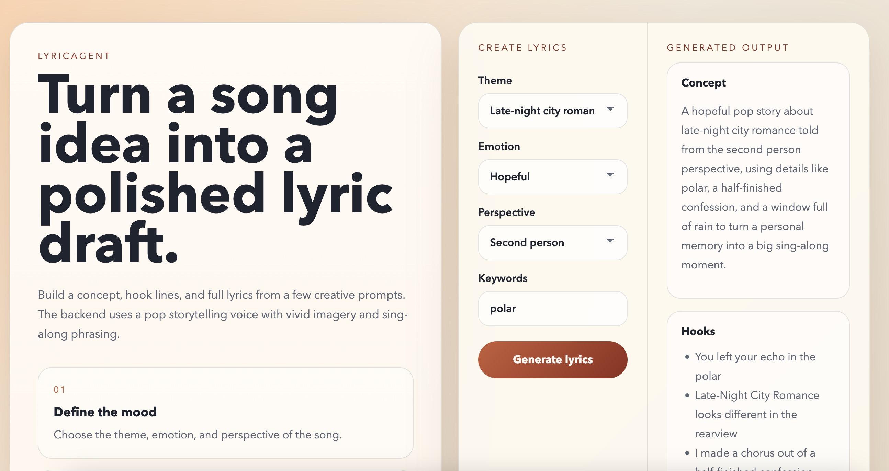

# LyricAgent

A small full-stack lyrics generator with:

- `frontend/`: React + Vite UI
- `backend/`: FastAPI API

The app collects a song theme, emotion, perspective, and keywords, sends them to the backend, and returns:

- a song concept
- hooks
- generated lyrics

Note: this project does not imitate or reproduce Taylor Swift's exact style. Instead, it uses a broader pop storytelling approach with confessional details, strong imagery, and catchy hooks.

## Preview



## Project structure

```text
LyricAgent/
├── backend/
│   ├── app/
│   │   ├── __init__.py
│   │   ├── main.py
│   │   ├── models.py
│   │   └── services.py
│   └── requirements.txt
├── frontend/
│   ├── public/
│   │   └── vite.svg
│   ├── src/
│   │   ├── App.css
│   │   ├── App.jsx
│   │   ├── index.css
│   │   └── main.jsx
│   ├── .env.example
│   ├── index.html
│   ├── package.json
│   └── vite.config.js
├── docs/
│   └── lyricagent-preview.png
└── README.md
```

## Run locally

### Backend

```bash
cd backend
python -m venv .venv
source .venv/bin/activate
pip install -r requirements.txt
uvicorn app.main:app --reload --port 8000
```

### Frontend

```bash
cd frontend
npm install
npm run dev
```

The frontend expects the backend at `http://localhost:8000` by default.

 
